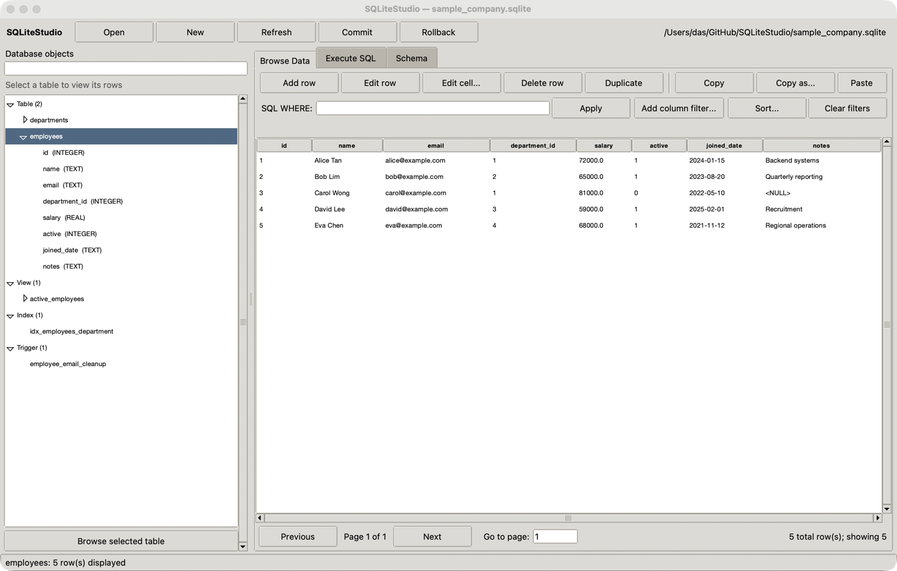
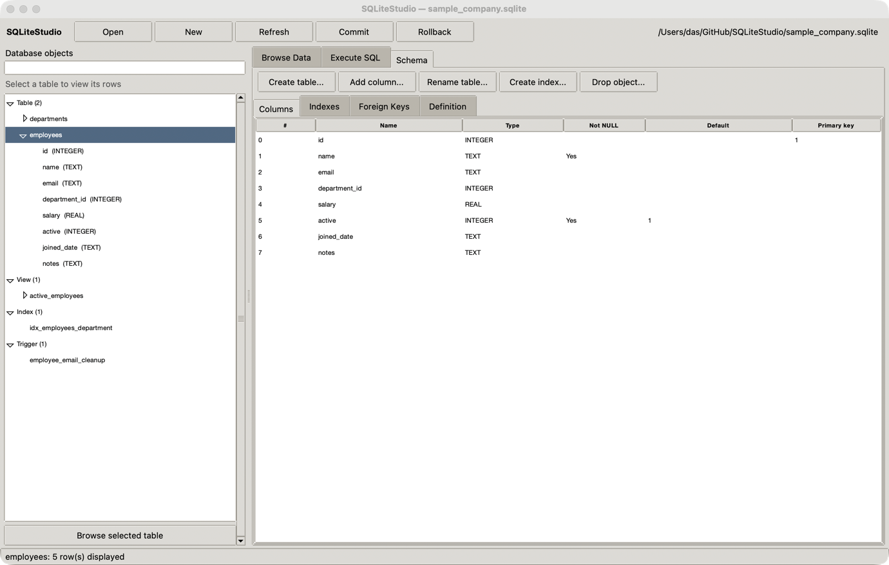
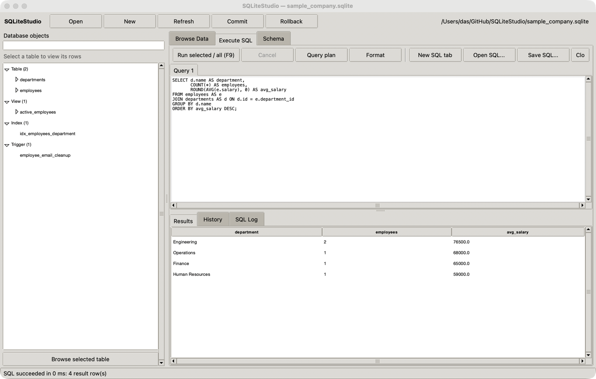

# SQLiteStudio

SQLiteStudio provides two source-only desktop applications for browsing, editing and querying SQLite databases:

| Edition | Source file | Platform | Requirements | Best fit |
|---|---|---|---|---|
| Python studio | `studio.py` | Windows, macOS and Linux | Python 3.10+ with Tkinter | The broadest feature set with no third-party Python packages |
| C# studio | `SQLiteStudio.cs` | Windows | .NET 10 SDK | A more modern native Windows interface and stricter data-editing safeguards |

Both editions run from source. This repository does not ship or require a prebuilt executable.

The Python studio remains the full-featured, cross-platform edition. The C# studio is an additional Windows edition focused on the core browse, edit, schema and SQL workflows; it does not replace `studio.py`.

## Choose an edition

Use the Python studio when you need cross-platform support, CSV or JSON import, schema designers, projects, backups, charting, table-wide exports or multiple SQL tabs.

Use the C# studio when you are on Windows, already have the .NET 10 SDK and prefer a native WinForms interface with high-DPI support, background SQL execution, explicit transaction controls and source-level Visual Studio support.

| Capability | Python studio | C# studio |
|---|:---:|:---:|
| Browse tables, views, indexes and triggers | Yes | Yes |
| Filter, sort and page through data | Yes | Yes |
| Add, edit, duplicate and delete rows | Yes | Yes |
| Composite keys and `WITHOUT ROWID` tables | Yes | Yes |
| Commit and rollback pending changes | Yes | Yes |
| Schema inspection | Yes | Yes |
| Visual schema changes | Yes | Use the SQL workspace |
| Background and cancellable SQL | Yes | Yes |
| Named and positional parameters | Yes | Yes |
| Multiple SQL tabs and `.sql` files | Yes | Not yet |
| CSV and JSON import | Yes | Not yet |
| CSV and JSON export | Yes | Visible rows |
| SQL dump, backup and projects | Yes | Not yet |
| Search, profiling and charts | Yes | Not yet |
| Light and dark themes | Yes | Yes |
| Cross-platform GUI | Yes | No, Windows only |

See [ROADMAP.md](ROADMAP.md) for planned work and edition-specific status.

## Python studio

### Requirements

- Python 3.10 or newer.
- Tkinter, normally included with Python on Windows and macOS. Some Linux distributions package it separately.
- No third-party Python packages.

### Run

Open PowerShell, Command Prompt or a terminal in the repository folder, then run:

```powershell
python studio.py
```

To open a database immediately:

```powershell
python studio.py "C:\path\to\database.sqlite"
```

If the command is named `python3` on your system, use `python3` instead.

## C# studio

### Requirements

- Windows 10 or newer.
- .NET 10 SDK.
- Visual Studio with .NET 10 support is optional.
- Network access on the first run so .NET can restore the pinned `Microsoft.Data.Sqlite` package. Later runs can use the local NuGet cache.

The C# studio is a .NET file-based app. Its target framework, WinForms configuration and SQLite package version are declared at the top of `SQLiteStudio.cs`, so it does not need a `.csproj` file.

### Run

From PowerShell, Command Prompt or a Visual Studio terminal:

```powershell
dotnet run SQLiteStudio.cs
```

To open a database immediately, put application arguments after `--`:

```powershell
dotnet run SQLiteStudio.cs -- "C:\path\to\database.sqlite"
```

You can also open `SQLiteStudio.cs` directly in a current Visual Studio version and run it as a file-based app.

Normal `dotnet run` compilation happens in .NET's per-user file-app cache. It does not add an executable, DLL, project file, `bin` directory or `obj` directory to this repository.

## Sample database

The Python generator creates a sample database containing related tables, constraints, an index, a view, a trigger and records:

```powershell
python .\create_sample_database.py
```

The generator asks before replacing an existing `sample_company.sqlite` file. Open the result with either studio:

```powershell
python .\studio.py .\sample_company.sqlite
```

```powershell
dotnet run .\SQLiteStudio.cs -- .\sample_company.sqlite
```

## Screenshots

The current screenshots show the Python studio. The C# studio uses the same three-workspace layout with a native Windows presentation.

### Browse and edit data

Explore tables, views, indexes and triggers, then filter, sort or edit records without writing SQL.



### Inspect the schema

Review columns, types, constraints, indexes, foreign keys and SQL definitions.



### Run SQL

Write queries and inspect their results, history and execution log in the same workspace.



## Shared data-editing behavior

- Browse tables and views from an expandable object tree.
- Display 500 records per page with an exact filtered row count.
- Sort from column headings and filter with a SQL `WHERE` expression.
- Add, edit, duplicate or delete rows with parameterized statements.
- Keep changes pending until **Commit**, or discard them with **Rollback**.
- Render SQL `NULL` distinctly from an empty string.
- Disable unsafe direct editing when a table has neither a primary key nor an accessible SQLite `rowid`.

Both editions fetch displayed data and row keys in the same query and add stable key columns to sort order. This prevents an edit or delete from targeting the wrong record when sorted values are tied. Composite primary keys and `WITHOUT ROWID` tables are supported.

## Python-only workflows

The Python studio currently provides these additional workflows:

- parameterized column-filter and multi-column sort builders;
- search across tables, column profiling and numeric plots;
- copy and paste of tab-separated cell ranges;
- copy as CSV, JSON, Markdown or SQL `INSERT` statements;
- table and index designers plus common `ALTER TABLE` operations;
- multiple SQL tabs, SQL file open/save and completion;
- CSV and JSON import with affinity inference;
- full-table CSV, JSON, Markdown and SQL export;
- SQL dumps, migrations, online backup and JSON projects;
- database attachment, PRAGMA editing and additional maintenance tools;
- recent files, reopen-last settings and adjustable text size.

## C# edition safeguards and behavior

The C# studio emphasizes predictable Windows behavior:

- uses a native WinForms layout with high-DPI support and light/dark themes;
- keeps table edits in an explicit transaction until commit or rollback;
- runs SQL work in the background and exposes cancellation;
- executes multi-statement batches without breaking trigger bodies at internal semicolons;
- binds `:name`, `@name`, `$name` and `?` parameters using typed prompts;
- limits the displayed final result set to 5,000 rows and reports truncation;
- treats generated columns separately from virtual-table hidden columns;
- edits BLOB values as hexadecimal data instead of silently converting them to text;
- falls back to read-only mode when a database cannot be opened safely for writing;
- enables foreign keys, a five-second busy timeout and WAL mode when supported;
- provides integrity, foreign-key, optimize and vacuum commands.

## Keyboard shortcuts

### Shared shortcuts

| Shortcut | Action |
|---|---|
| `Ctrl+O` | Open database |
| `Ctrl+N` | Create database |
| `Ctrl+S` | Commit changes |
| `F5` | Refresh schema |
| `F9` | Run selected or complete SQL |
| `Ctrl+C` | Copy selected rows |
| `Delete` | Delete selected rows |

### Python studio shortcuts

| Shortcut | Action |
|---|---|
| `Ctrl+Space` | SQL completion chooser |
| `Ctrl+V` | Paste cells |
| `Ctrl++` / `Ctrl+-` | Change text size |
| `Ctrl+0` | Reset text size |
| `Ctrl+F` | Search all tables |

### C# studio shortcuts

| Shortcut | Action |
|---|---|
| `Ctrl+Shift+S` | Roll back changes |
| `Ctrl+L` | Open the SQL workspace |
| `Ctrl+E` | Edit the selected row |
| `Ctrl+Insert` | Add a row |
| `Ctrl+D` | Duplicate the selected row |
| `Ctrl+T` | Toggle the light/dark theme |

## Safety notes

- Back up important databases before destructive schema changes or unfamiliar SQL scripts.
- SQL in the raw `WHERE` box and SQL workspace runs as written. These tools are intended for trusted local databases and trusted SQL.
- Review pending changes before committing. Rollback only affects work that has not already been committed.
- The C# studio requires commit or rollback before `VACUUM`; the Python studio exposes its equivalent maintenance checks in the Database menu.
- SQLite capabilities depend on the runtime used by the selected edition.
- SQLCipher databases and arbitrary external SQLite extensions are not supported by either edition.

## Development checks

Build the C# file-based app without creating project artifacts in the repository:

```powershell
dotnet build SQLiteStudio.cs
```

The Python `selftest.py` entry point still references a legacy module name and is tracked as maintenance work in the roadmap. Do not treat it as a passing release check until that import is aligned with `studio.py`.

Keep edition-specific claims in this README and the roadmap synchronized whenever features are added or behavior changes.
