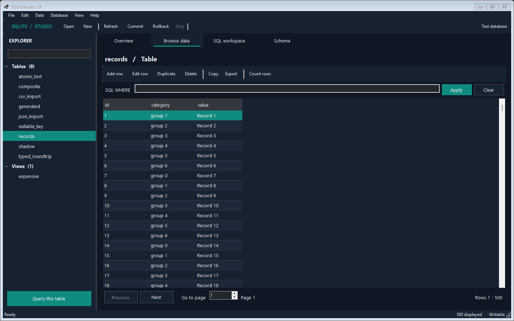
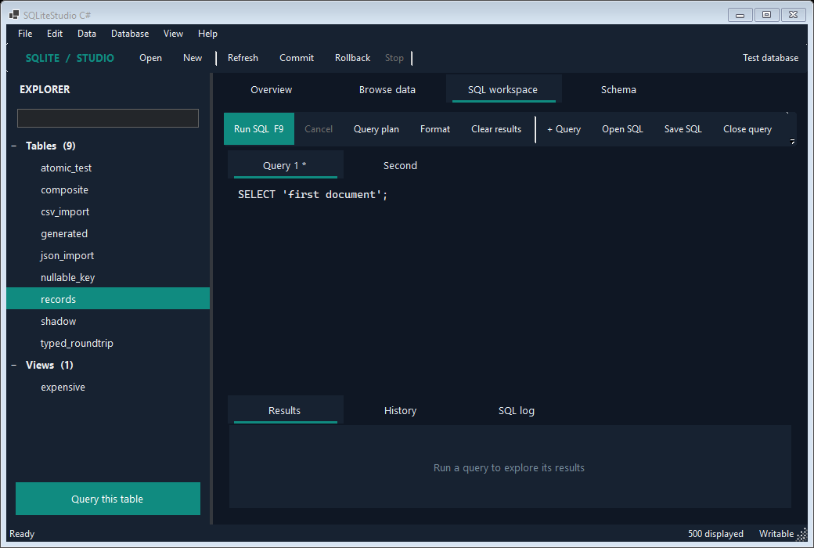

# SQLiteStudio

SQLiteStudio provides two source-only desktop applications for browsing, editing and querying SQLite databases:

| Edition | Source file | Platform | Requirements | Best fit |
|---|---|---|---|---|
| Python studio | `studio.py` | Windows, macOS and Linux | Python 3.10+ with Tkinter | The broadest feature set with no third-party Python packages |
| C# studio | `SQLiteStudio.cs` | Windows | .NET 10 SDK | A native workbench with background operations and guarded editing |

Both editions run from source. This repository does not ship or require a prebuilt executable.

The Python studio has the broadest feature set. The C# edition provides a native Windows workspace, virtual grids, multiple query tabs, imports, full filtered exports and backups. The editions have different capabilities; see the comparison below.

## Choose an edition

Use the Python studio when you need cross-platform support, visual schema designers, projects, cross-table search or charting.

Use the C# studio for a native Windows workflow with light/dark themes, a database overview, recent files, query tabs, background database operations and explicit commit/rollback. Search, profiling, charts, projects and visual schema designers remain Python-only.

| Capability | Python studio | C# studio |
|---|:---:|:---:|
| Browse tables, views, indexes and triggers | Yes | Yes |
| Filter, sort and page through data | Yes | Yes |
| Add, edit, duplicate and delete rows | Yes | Yes |
| Composite keys and `WITHOUT ROWID` tables | Yes | Yes |
| Commit and rollback pending changes | Yes | Yes |
| Schema inspection | Yes | Yes |
| Visual schema changes | Yes | Use the SQL workspace |
| Background and cancellable SQL | Yes | Yes |
| Named and positional parameters | Yes | Yes |
| Open/save `.sql` files | Yes | Yes |
| Multiple SQL tabs | Yes | Yes |
| CSV and JSON import | Yes | New table with preview |
| CSV and JSON export | Yes | Visible rows or all matching rows |
| SQLite backup | Yes | Yes, verified before saving |
| SQL INSERT export | Yes | All matching rows |
| Schema dump and projects | Yes | Not yet |
| Search, profiling and charts | Yes | Not yet |
| Light and dark themes | Yes | Yes |
| Cross-platform GUI | Yes | No, Windows only |

See [ROADMAP.md](ROADMAP.md) for planned work and edition-specific status.

## Python studio

### Requirements

- Python 3.10 or newer.
- Tkinter, normally included with Python on Windows and macOS. Some Linux distributions package it separately.
- No third-party Python packages.

### Run

Open PowerShell, Command Prompt or a terminal in the repository folder, then run:

```powershell
python studio.py
```

To open a database immediately:

```powershell
python studio.py "C:\path\to\database.sqlite"
```

If the command is named `python3` on your system, use `python3` instead.

## C# studio

### Requirements

- Windows 10 or newer.
- .NET 10 SDK.
- Visual Studio with .NET 10 support is optional.
- No NuGet packages and no internet access.

The C# studio is a .NET file-based app. Its target framework and WinForms configuration are declared at the top of `SQLiteStudio.cs`, so it does not need a `.csproj` file. SQLite access goes directly through `winsqlite3.dll`, the SQLite library included with Windows. Keep Windows updated because Windows Update services that system component.

### Run

From PowerShell, Command Prompt or a Visual Studio terminal:

```powershell
dotnet run SQLiteStudio.cs
```

To open a database immediately, put application arguments after `--`:

```powershell
dotnet run SQLiteStudio.cs -- "C:\path\to\database.sqlite"
```

You can also open `SQLiteStudio.cs` directly in a current Visual Studio version and run it as a file-based app.

Normal `dotnet run` compilation happens in .NET's per-user file-app cache. It does not add an executable, DLL, project file, `bin` directory or `obj` directory to this repository.

The file disables NuGet auditing and tells restore to ignore unreachable package sources. Because it has no package references, `dotnet run SQLiteStudio.cs` does not need to retrieve SQLite or other application dependencies from a remote feed.

### C# offline troubleshooting

If an error still mentions `Microsoft.Data.Sqlite`, the laptop has an older copy of `SQLiteStudio.cs`. In the current file, the directives at the top do not contain any `#:package` line. Replace the old file or pull the latest repository version, then clear the file-app cache once:

```powershell
dotnet clean file-based-apps
dotnet run SQLiteStudio.cs
```

If the error instead names `Microsoft.WindowsDesktop.App.Ref`, the machine does not have a complete .NET 10 Windows Desktop SDK installation. Install or repair the approved .NET 10 SDK or Visual Studio .NET desktop workload through the organization's normal software channel. That framework pack is part of the development environment, not an SQLiteStudio package.

## Sample database

The Python generator creates a sample database containing related tables, constraints, an index, a view, a trigger and records:

```powershell
python .\create_sample_database.py
```

The generator asks before replacing an existing `sample_company.sqlite` file. Open the result with either studio:

```powershell
python .\studio.py .\sample_company.sqlite
```

```powershell
dotnet run .\SQLiteStudio.cs -- .\sample_company.sqlite
```

## Screenshots

The Python screenshots below demonstrate the cross-platform edition. The C# edition has an Overview, Browse data, SQL workspace and Schema, with a native Windows presentation.





### Browse and edit data

Explore tables, views, indexes and triggers, then filter, sort or edit records without writing SQL.


### Inspect the schema

Review columns, types, constraints, indexes, foreign keys and SQL definitions.


### Run SQL

Write queries and inspect their results, history and execution log in the same workspace.


## Shared data-editing behavior

- Browse tables and views from an expandable object tree.
- Display 500 records per page. Python shows an exact filtered count; C# loads pages without counting the entire result and provides an explicit **Count rows** action.
- Sort from column headings and filter with a SQL `WHERE` expression.
- Add, edit, duplicate or delete rows with parameterized statements.
- Keep changes pending until **Commit**, or discard them with **Rollback**.
- Render SQL `NULL` distinctly from an empty string.
- Disable unsafe direct editing when a table has neither a primary key nor an accessible SQLite `rowid`.

Both editions fetch displayed data and row keys in the same query and add stable key columns to sort order. This prevents an edit or delete from targeting the wrong record when sorted values are tied. Composite primary keys and `WITHOUT ROWID` tables are supported.

## Additional Python workflows

The Python studio currently provides these additional workflows:

- parameterized column-filter and multi-column sort builders;
- search across tables, column profiling and numeric plots;
- copy and paste of tab-separated cell ranges;
- copy as CSV, JSON, Markdown or SQL `INSERT` statements;
- table and index designers plus common `ALTER TABLE` operations;
- SQL completion;
- CSV and JSON import with affinity inference (C# imports CSV fields as text and preserves JSON values conservatively);
- Markdown export in addition to CSV, JSON and SQL;
- schema dumps, migrations and JSON projects;
- database attachment, PRAGMA editing and additional maintenance tools;
- reopen-last settings and adjustable text size.

## C# edition safeguards and behavior

The C# studio emphasizes predictable Windows behavior:

- uses a native WinForms layout with high-DPI support and light/dark themes;
- keeps table edits in an explicit transaction until commit or rollback;
- runs SQL, paging, schema inspection, row edits, maintenance, imports, exports and backups in the background, with **Stop** / **Esc** cancellation;
- uses virtual grids, preserves column widths between pages and filters cached schema objects without querying SQLite;
- keeps menus and controls visible under Windows DPI scaling;
- provides independent query tabs, SQL file open/save, find, and unsaved-text warnings;
- offers an Overview, recent databases, drag-and-drop opening and a remembered theme;
- applies edits and query batches under savepoints, rolling back a failed operation while preserving earlier pending work when SQLite keeps the outer transaction active;
- checks original row values before editing/deleting, preventing stale rows from silently overwriting newer values;
- executes multi-statement batches without breaking trigger bodies at internal semicolons;
- binds `:name`, `@name`, `$name` and `?` parameters using typed prompts;
- limits the displayed final result set to 5,000 rows and reports truncation; stops reading discarded read-only rows while still completing writes and subsequent statements;
- treats generated columns separately from virtual-table hidden columns;
- edits BLOB values as hexadecimal data instead of silently converting them to text;
- falls back to read-only mode when a database cannot be opened safely for writing;
- enables foreign keys, a five-second busy timeout and WAL mode when supported;
- provides integrity, foreign-key, optimize and vacuum commands.

## Keyboard shortcuts

### Shared shortcuts

| Shortcut | Action |
|---|---|
| `Ctrl+O` | Open database |
| `Ctrl+N` | Create database |
| `Ctrl+S` | Commit changes |
| `F5` | Refresh schema |
| `F9` | Run selected or complete SQL |
| `Ctrl+C` | Copy selected rows |
| `Delete` | Delete selected rows |

### Python studio shortcuts

| Shortcut | Action |
|---|---|
| `Ctrl+Space` | SQL completion chooser |
| `Ctrl+V` | Paste cells |
| `Ctrl++` / `Ctrl+-` | Change text size |
| `Ctrl+0` | Reset text size |
| `Ctrl+F` | Search all tables |

### C# studio shortcuts

| Shortcut | Action |
|---|---|
| `Ctrl+Shift+S` | Roll back changes |
| `Ctrl+L` | Open the SQL workspace |
| `Ctrl+E` | Edit the selected row |
| `Ctrl+Insert` | Add a row |
| `Ctrl+D` | Duplicate the selected row |
| `Ctrl+T` | Toggle the light/dark theme |
| `Ctrl+Shift+N` | New query tab |
| `Ctrl+F` | Find in the active query |
| `Esc` | Cancel the current database operation |

## Safety notes

- Back up important databases before destructive schema changes or unfamiliar SQL scripts.
- SQL in the raw `WHERE` box and SQL workspace runs as written. These tools are intended for trusted local databases and trusted SQL.
- Review pending changes before committing. Rollback only affects work that has not already been committed.
- The C# studio requires commit or rollback before `VACUUM`; the Python studio exposes its equivalent maintenance checks in the Database menu.
- SQLite capabilities depend on the runtime used by the selected edition.
- The C# edition uses the SQLite version supplied and serviced by Windows; keep the office laptop current with approved Windows updates.
- SQLCipher databases and arbitrary external SQLite extensions are not supported by either edition.

## Development checks

Build the C# file-based app without creating project artifacts in the repository:

```powershell
dotnet build SQLiteStudio.cs
```

Run the core and Windows C# integration checks:

```powershell
python selftest.py
python selftest_csharp.py
```

The C# checks compile the actual application source into a temporary test harness and exercise virtual paging, row identities, generated columns, cancellation, large read-only result limits and rollback of `RETURNING` writes. Build outputs stay outside the repository. Pass a directory to `selftest_csharp.py` to also render light/dark UI screenshots. If a running app locks the usual build output, build into a separate temporary directory with `dotnet build SQLiteStudio.cs -o "$env:TEMP\SQLiteStudio-review-build"`.

C# paging still uses `LIMIT/OFFSET`: deep pages and unindexed sorts can be expensive. The C# edition does not yet include Python's visual schema designers, charts or projects.

### C# import, export and transaction details

- **Import** creates a new table after showing up to 100 preview records. CSV streams through a reusable prepared insert; all fields stay text, including leading zeroes and empty strings. JSON accepts an array of objects up to 32 MB: integer values and nulls retain their types; other numbers and nested values are retained as text to avoid precision loss.
- **Export all matching rows** streams CSV, JSON or SQL INSERT statements using the current WHERE filter. It writes a temporary file and replaces the destination only after success. CSV represents SQL NULL as an empty field; JSON preserves null and encodes BLOBs as base64; SQL represents BLOBs as hex literals. SQL exports omit generated columns.
- **Backup** uses SQLite's online backup API, verifies the copy with `quick_check`, and saves to a new filename. Commit or roll back first. A backup does not overwrite an existing database.
- **Queries** finish writes even when `RETURNING` exceeds the display cap. Discarded read-only rows are skipped. Use the toolbar for transaction control and maintenance; raw BEGIN/COMMIT/ROLLBACK, ATTACH/DETACH, VACUUM and setting PRAGMAs are rejected in query batches.
- **Cancellation** can cause SQLite itself to roll back an interrupted write transaction, including earlier pending edits. The pending-change indicator is synchronized with SQLite afterward.
- **SQL files** up to 16 MB open in separate tabs. Saves replace the destination only after the temporary write succeeds. Query tabs and history are session-local; save SQL files before closing.
- Recent paths and theme preferences live in `%LOCALAPPDATA%\SQLiteStudio\settings.json`. SQL text and database contents are not stored in this preferences file.

To verify the compact 96-DPI layout as well as the machine's native DPI, run:

```powershell
$env:STUDIO_TEST_DPI = '96'
python selftest_csharp.py "$env:TEMP\studio-screenshots-96"
Remove-Item Env:STUDIO_TEST_DPI
```

Keep edition-specific claims in this README and the roadmap synchronized whenever features are added or behavior changes.
